# StudySync
StudySync is a platform for students to find study-buddies, discover study spots, and be productive.

## Problem:
- Students, especially new ones, struggle to find study buddies who can keep them accountable, share information or generally socialize.  As a second year student, I have noticed that the best context for academic socialization - the university, is not being utilized properly. People either do not come to class, or those who do, are reluctant to talk to new people. Moreover, most universities only provide events for either social or professional purposes, NOT academic.
- Another issue is that students are often unaware of the best places to study. Sometimes they find a cafe which turns out to have a strict laptop policy, or go to the library which turns out to be packed. That is frustrating and unmotivating. An online platform with a clear list of options would be extremely helpful. 

## Solution:
My app prototype addresses the issue in several ways:
1. **Study buddy finder**: Each student (verified by institution only) can search for a study buddy by filtering through other students by institution, program, hobbies, gender, or age.
2. **Study group finder**: Anonymous users are matched based on their preferences and a reservation is made in the university, a cafe, or other study spots. Users can also join existing groups. Importantly, the app reorganizes groups in case of cancellations and keeps track of who cancels too often.
3. **Study spot search**: A number of study spots are listed on the platform, which students can scroll through and find out their amenities. They can also leave and view reviews from other students.
4. **Individual focus function**: Sometimes, plans do not work out. And sometimes you want to study alone while also keeping track. The app's focus function blocks all other apps on the phone and utilizes productivity tools such as timers, pomodoro timers, stopwatches. Daily/Weekly statistics of both users and their friends can be seen.

Whatever happens, the user still ends up studying.

## Example of user flow:
1. User creates an account (only using official university mail), mentions their hobbies, major, etc., and answers a question from a prompt. After choosing an avatar from available emojis (no profile pictures).
2. After a built-in tour, the student can either match with another student by filtering through their preferred metrics, or join a group session. Group sessions are booked 24 hours in advance and are anonymous, only the preferred noise level is known. The user can either join an existing group or book a session with algorithmically chosen users in their preferred location.
3. If multiple people cancel (giving a reason, which will be shown in their "cancellation analytics" tab of the profile, the user can either withdraw from the group session, or focus on their own using the focus feature.

## Business model:
The app utilizes a subscription model and ads (freemium). 
- The monthly fee is €4.90, the yearly fee is €39.90.
- The focus feature is intended to boost user-retention, as without it, the users would find study buddies and stop using the app. Some of the features (full data analytics of the focus tab, stopwatch/timer use) are paid.
- Ad removal also comes with subscription.

## Limitations
- No mechanism to connect real users yet
- No integration with educational institutions/venues
- Simulated group matching and sessions
**My prototype is mainly a conceptual design rather than a fully technical product for now.**

## Screenshots:
### Home page:

  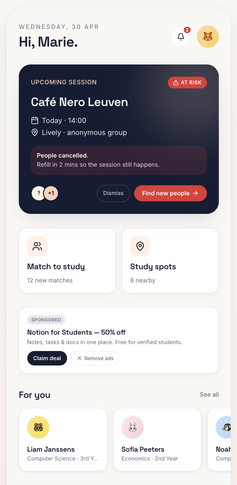
  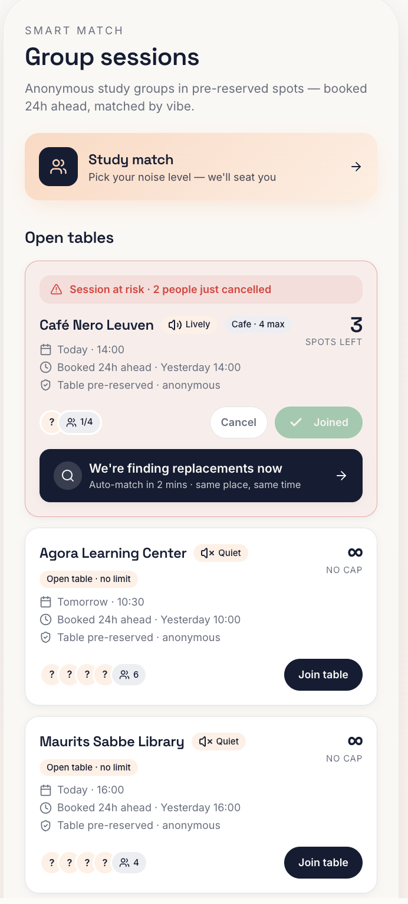
  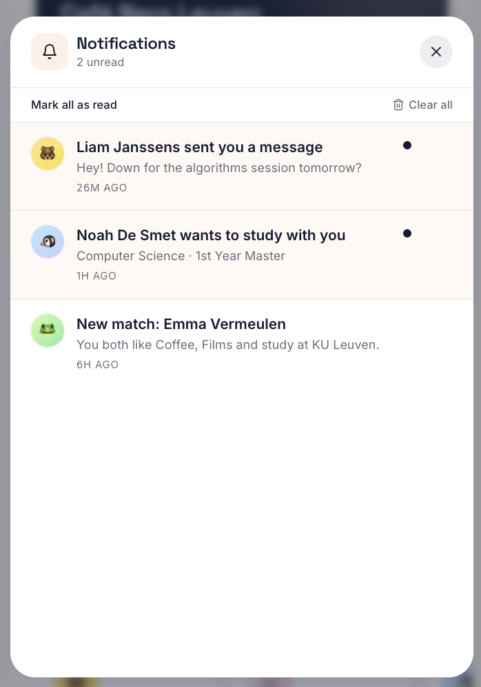

Inside the home page, profile page:

  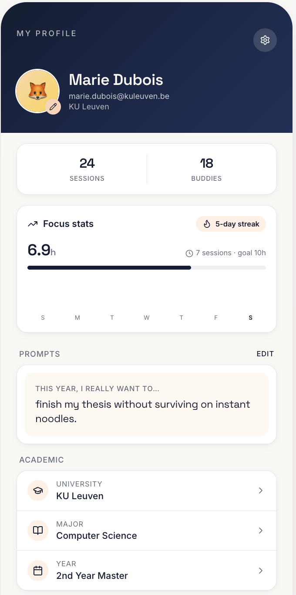
  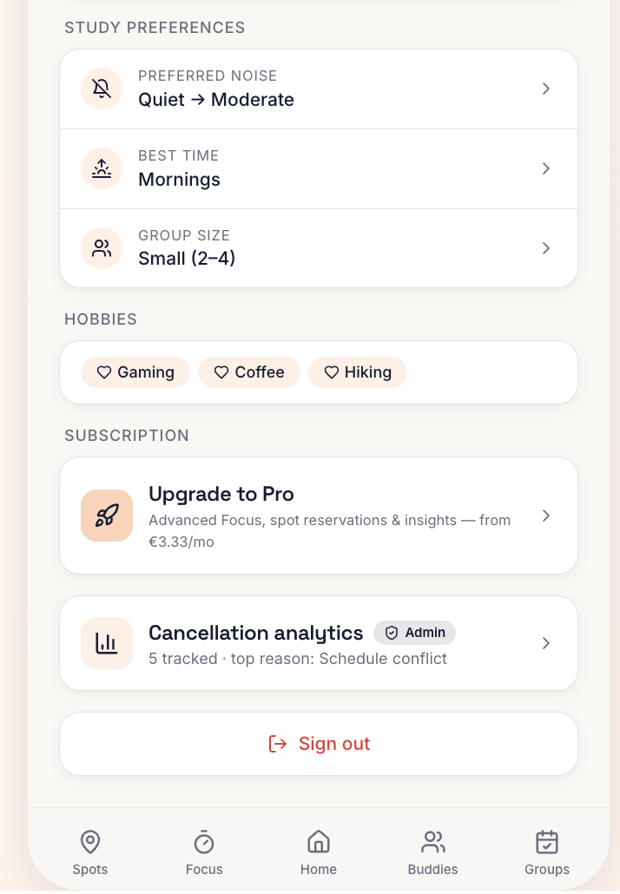

### Study spots:

  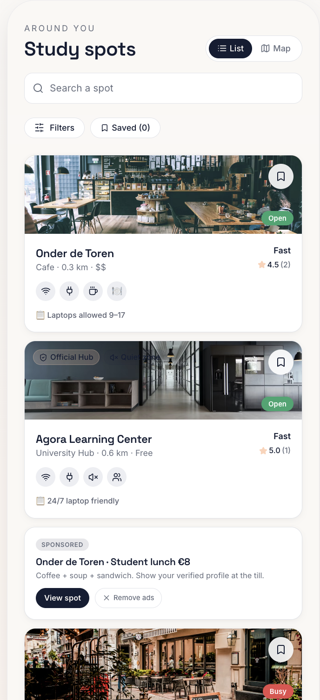
  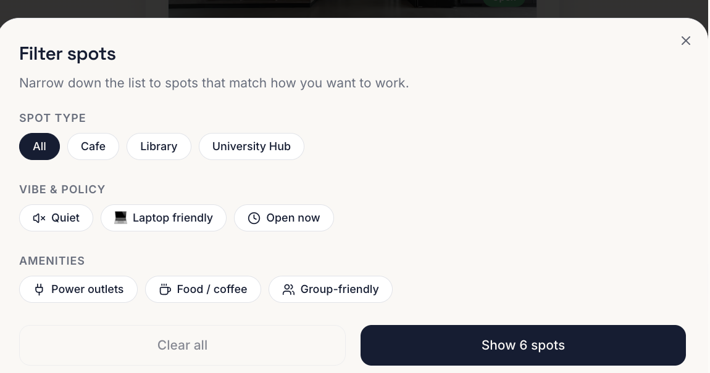

### Buddies:

  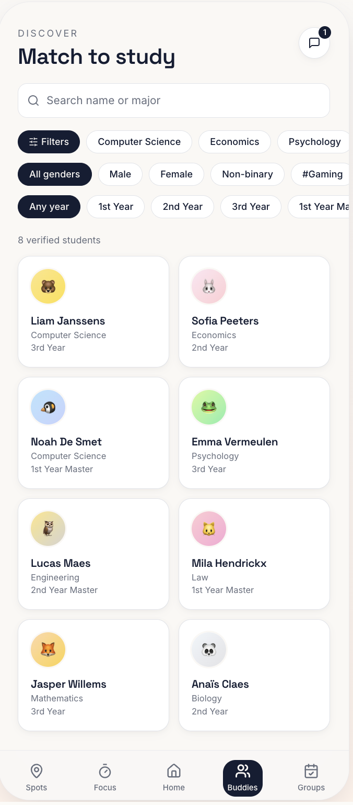
  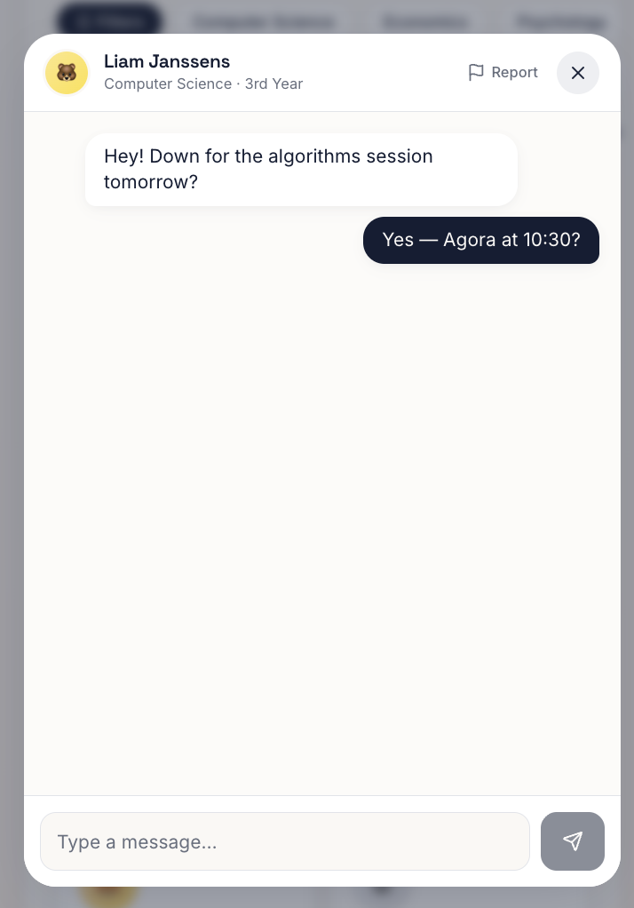

### Focus:

  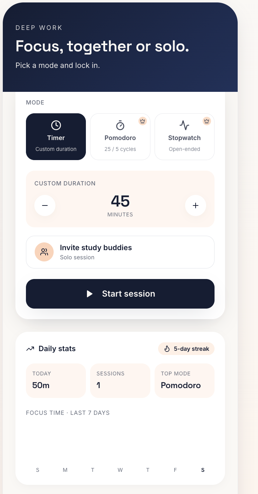
  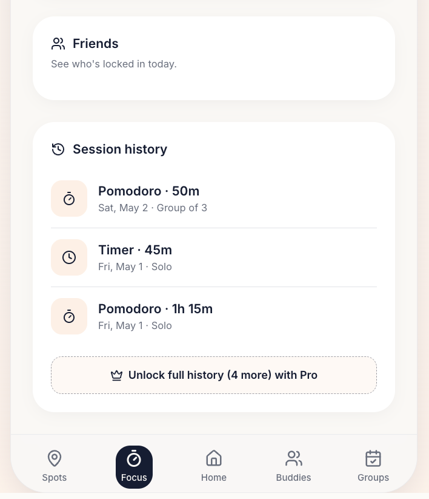

### Group finder:

  
  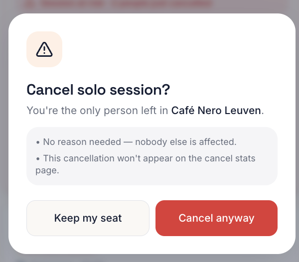

### Login page:

  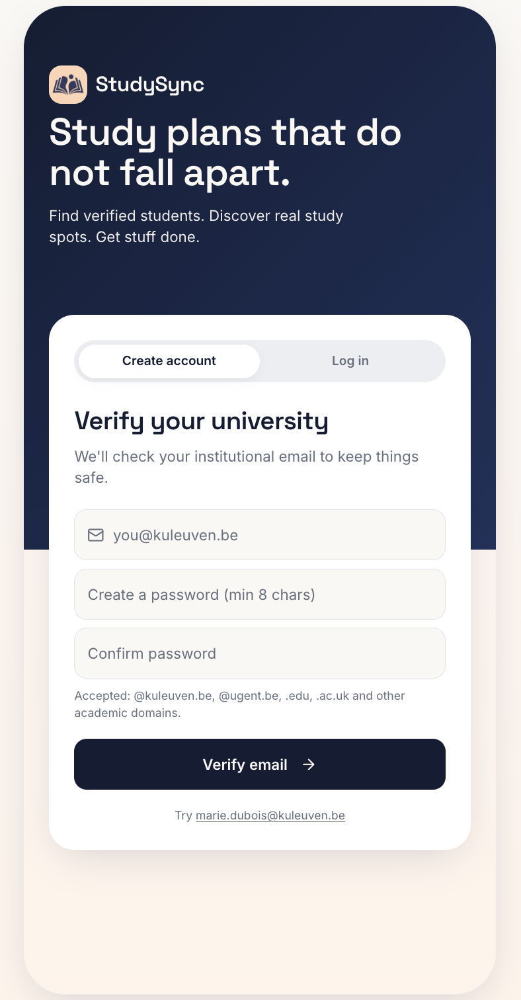

  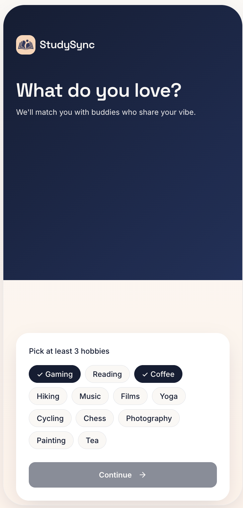
  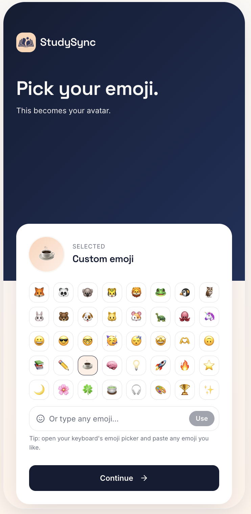
  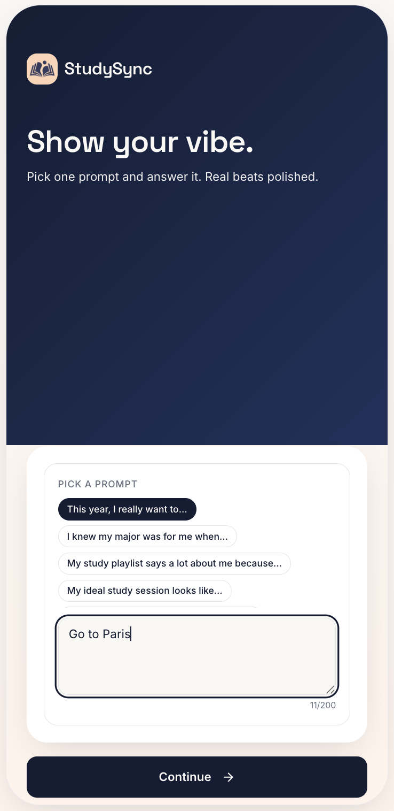

## Feedback:
This is a very early prototype. Any feedback would not only be welcomed, but also necessary!:)
